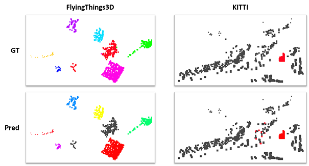

# 3D Motion Segmentation with SSC

This repository implements a SSC-based motion segmentation algorithm on 2-frame point cloud (scene flow).
The implementation basically follows this paper [3D Motion Segmentation of Articulated Rigid Bodies based on RGB-D Data](http://bmvc2018.org/contents/papers/0901.pdf).

# Data preparation

The implemented algorithm is tested on synthetic data and real data.

## Synthetic data

Please play with [prepare_toy_data.py](prepare_toy_data.py) to generate synthetic datasets.

## Real data

The algorithm is tested on 2 public scene flow datasets: FlyingThings3D and KITTI.
The processed data is available at [real_data.zip](real_data.zip)

You can also download the source data and process it by yourself.
Please first follow the guidelines in [flowstep3d](https://github.com/yairkit/flowstep3d) to download and preprocess the data.
Then use the provided [prepare_real_data.py](prepare_real_data.py) for further processing.

# How to use

On toy data

```
python eval_toy_data.py --data_path <Path to data> --n_cluster <GT number of clusters> --normalize
```

On real data

```
# FlyingThings3D
python eval_real_data.py --data_path real_data/flythings3d --normalize --min_n_cluster 2 --max_n_cluster 20
# KITTI
python eval_real_data.py --data_path real_data/kitti --normalize --min_n_cluster 2 --max_n_cluster 10
```

# Performance

## Qualitative results



## Quantitative results

On FlyingThings3D

| Dataset | SSR error | Clustering error | AP@50 | Precision@50 | Recall@50 |
| ----- | ----- | ----- | ----- | ----- | ----- |
| FT3D | 0.0290 | 0.3723 | 0.5026 | 0.7575 | 0.2476 |
| FT3D (>0.01) | 0.0259 | 0.3601 | 0.5506 | 0.7510 | 0.3502 |
| FT3D (>0.02) | 0.0256 | 0.3151 | 0.6248 | 0.7893 | 0.4603 |

(* For FT3D, only first 200 samples in test set are evaluated)

On KITTI

| Dataset | SSR error | Clustering error | AP@50 | Precision@50 | Recall@50 |
| ----- | ----- | ----- | ----- | ----- | ----- |
| KITTI | 0.0078 | 0.3030 | 0.5369 | 0.4391 | 0.6348 |
| KITTI (>0.01) | 0.0078 | 0.3045 | 0.5386 | 0.4360 | 0.6411 |
| KITTI (>0.02) | 0.0076 | 0.3060 | 0.5563 | 0.4303 | 0.6824 |

(* > 0.01/0.0.2 means objects with too few points are removed)

# Acknowledgements

[sparse-subspace-clustering-python](https://github.com/abhinav4192/sparse-subspace-clustering-python)

[STSC](https://github.com/wOOL/STSC)

[flowstep3d](https://github.com/yairkit/flowstep3d)